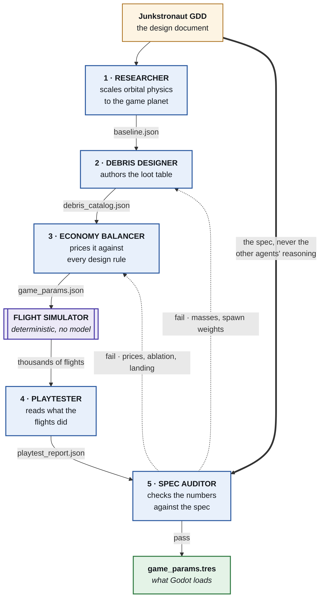

# Junkstronaut — agent crews

> ### Grading Assignment #3? Start here.
>
> **The submission is [`crew/`](crew/)** — five agents that write this game's config file.
> Nothing to install — no dependencies, no `npm install`, no API key. Built and tested on Node 24.
>
> ```bash
> cd crew
> node run-crew.js --stub        # replay a recorded run: full output in ~1 second, no API key
> node --test "test/*.test.js"   # 95 tests, ~18 seconds
> ```
>
> Then open **`crew/out/report/dashboard.html`** in a browser for the charts, and
> **`crew/out/config/game_params.tres`** for the artifact the game actually loads.
> The Mermaid architecture diagram is **[`crew/DIAGRAM.md`](crew/DIAGRAM.md)**.
>
> `board/` is a **different crew from Assignment #2** and is not part of this submission.

**The game: Junkstronaut.** A 2D pixel-art game about salvaging space junk. A Kessler
cascade has destroyed every satellite in orbit. You work at Mr. Armstrong's junkyard: fly a
rocket built out of scrap up to the debris field, get out and drag junk home on magnetic
tethers, survive reentry, land it. Sell the haul, buy upgrades, go higher. This is my
capstone project.

Two crews in this repo. Both are raw Node orchestration — no framework, no dependencies —
and both run against this game's design document.

---

## `crew/` — the tuning crew · **Assignment #3 submission**

**Five agents and a flight simulator write the game's config file.**

Not a document about the config — `config/game_params.tres`, the resource Godot loads at
runtime. Junkstronaut's design says every tunable value lives in one file and nothing is
hardcoded: gravity, thrust, heat shield ablation, tow fees, magnet hold force, what each
piece of junk weighs and what it sells for. This crew writes that file, plus the debris
catalog it prices, an audit of whether the numbers obey the design document, and a playtest
report of what those numbers actually *do* when the ship is flown.

| agent | reads → writes |
|---|---|
| **researcher** | GDD → `params/baseline.json` — orbital speeds, atmosphere, heating thresholds, drag |
| **debris-designer** | baseline → `data/debris_catalog.json` — 28 junk types: mass, size class, fragility |
| **economy-balancer** | baseline + catalog → `config/game_params.json` — every tunable, solved against all design rules at once |
| **playtester** | simulator output → `playtest/playtest_report.json` — claimed vs measured, proposed fixes |
| **spec-auditor** | GDD + params + measurements → `audit/audit_report.md` — per-rule pass/fail with evidence |



The two dotted edges are the feedback loop: a failed audit goes back to the agent that owns
the artifact the rule is about, and drives up to two revision rounds. Full diagram, including
the orchestrator's control flow: [`crew/DIAGRAM.md`](crew/DIAGRAM.md).

Every arrow is a schema-checked JSON file on disk, not chat history, so any stage re-runs
alone. The auditor gets the spec and the numbers but never the other agents' reasoning, so
it can't be talked into agreeing; when it fails a check it routes the failure to the agent
that owns those values, which drives up to two revision rounds.

A **flight simulator** sits in the middle — deterministic, no model. It launches, aerobrakes
and lands the ship thousands of times per round, then re-flies a grid of 5,184 worlds
against 8 design targets. So when the crew says a full hold lands at 4.4 m/s, that is a
measurement, not an argument.

```bash
cd crew
node run-crew.js --stub    # replay a recorded run — ~1 second, no login, no model calls
node run-crew.js           # live: 30–90 minutes
node --test "test/*.test.js"
```

Architecture diagram: [`crew/DIAGRAM.md`](crew/DIAGRAM.md). Full detail:
[`crew/README.md`](crew/README.md).

> A run ending in **`AUDIT FAIL`** means the crew found that the design's numbers don't
> satisfy the design document — the crew ran correctly. The last recorded run passes 18 of
> 20 checks; the 2 that fail need a human design decision, not a retune. Reporting that
> instead of hiding it is the point of having an auditor.

---

## `board/` — the design review board

**Nine agents review the design document itself.** Six specialists read it blind, then
cross-examine each other, a moderator synthesises what they found, and a visualisation
auditor checks the resulting report against the data it was built from. It produces a ranked
list of what is wrong with the document, an explicit list of what the board could not agree
on, and a page where every claim traces to a numbered finding a named reviewer raised.

Built after the tuning crew and sharing its agent runner and schema validator — one
direction only, so `crew/` still runs standalone. See [`board/README.md`](board/README.md).

```bash
cd board
node run-board.js
node --test "test/*.test.js"
```
