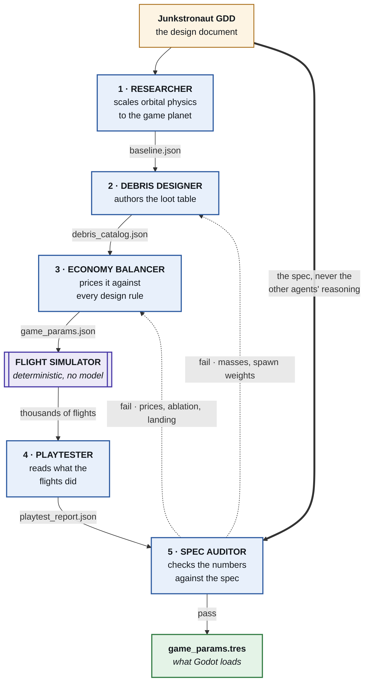

# Junkstronaut — agent crews

## Quick start

**Assignment #3 submission: the [`crew/`](crew/) folder.** Nothing to install — no
dependencies, no `npm install`, no API key needed for the replay. Tested on Node 24.

**1 · Get it**

```bash
git clone https://github.com/Chadleewalker/Junkstronaut
cd Junkstronaut/crew
```

(Or use the green **Code → Download ZIP** button and unzip it.)

**2 · Run it** — either way works:

```bash
claude              # then type:  /run-crew stub
```

```bash
node run-crew.js --stub     # same thing without Claude Code
```

Takes about a second. It replays a recorded run of the five agents, so you see the real
output without spending tokens. Drop `stub` / `--stub` to run the agents live instead
(30–90 minutes, needs Claude Code signed in).

**3 · Look at what it made** — everything lands in `crew/out/`:

| open this | what it is |
|---|---|
| **`out/report/dashboard.html`** | **Start here.** The whole run as charts in a browser — what the agents decided, what the simulator measured, and a plain-English verdict at the top. |
| `out/config/game_params.tres` | The point of the whole thing: the config file Godot loads at runtime. Every tunable in the game — gravity, thrust, heat, prices — in one file. |
| `out/audit/audit_report.md` | Per-rule pass/fail against the design document, with the arithmetic. Read this before trusting the numbers. |
| `out/data/debris_catalog.json` | The loot table — 25 junk types with mass, size and fragility. |
| `out/playtest/playtest_report.json` | What the ship actually did when flown: claimed vs. measured, and proposed fixes. |
| `out/run.json` | Run summary — which agents ran, how many retries, the final verdict. |

The console prints a summary when it finishes. **A run ending in `AUDIT FAIL` is not a
crash** — it means the crew measured the design's own numbers and found a rule they don't
satisfy. That is the auditor doing its job; the failing rule and its evidence are in
`audit_report.md`.

**Also here:** the architecture diagram is [`crew/DIAGRAM.md`](crew/DIAGRAM.md) (rendered
below too), the tests are `node --test "test/*.test.js"` from `crew/` (95 tests, ~18 s), and
[`board/`](board/) is a **separate crew from Assignment #2** — not part of this submission.

---

**The game: Junkstronaut.** A 2D pixel-art game about salvaging space junk. A Kessler
cascade has destroyed every satellite in orbit. You work at Mr. Armstrong's junkyard: fly a
rocket built out of scrap up to the debris field, get out and drag junk home on magnetic
tethers, survive reentry, land it. Sell the haul, buy upgrades, go higher. This is my
capstone project.

Two crews in this repo. Both are raw Node orchestration — no framework, no dependencies —
and both run against this game's design document.

---

## `crew/` — the tuning crew · **Assignment #3 submission**

**Five agents and a flight simulator write the game's config file.**

Not a document about the config — `config/game_params.tres`, the resource Godot loads at
runtime. Junkstronaut's design says every tunable value lives in one file and nothing is
hardcoded: gravity, thrust, heat shield ablation, tow fees, magnet hold force, what each
piece of junk weighs and what it sells for. This crew writes that file, plus the debris
catalog it prices, an audit of whether the numbers obey the design document, and a playtest
report of what those numbers actually *do* when the ship is flown.

| agent | reads → writes |
|---|---|
| **researcher** | GDD → `params/baseline.json` — orbital speeds, atmosphere, heating thresholds, drag |
| **debris-designer** | baseline → `data/debris_catalog.json` — the loot table: mass, size class, fragility |
| **economy-balancer** | baseline + catalog → `config/game_params.json` — every tunable, solved against all design rules at once |
| **playtester** | simulator output → `playtest/playtest_report.json` — claimed vs measured, proposed fixes |
| **spec-auditor** | GDD + params + measurements → `audit/audit_report.md` — per-rule pass/fail with evidence |



The two dotted edges are the feedback loop: a failed audit goes back to the agent that owns
the artifact the rule is about, and drives up to two revision rounds. Full diagram, including
the orchestrator's control flow: [`crew/DIAGRAM.md`](crew/DIAGRAM.md).

Every arrow is a schema-checked JSON file on disk, not chat history, so any stage re-runs
alone. The auditor gets the spec and the numbers but never the other agents' reasoning, so
it can't be talked into agreeing; when it fails a check it routes the failure to the agent
that owns those values, which drives up to two revision rounds.

A **flight simulator** sits in the middle — deterministic, no model. It launches, aerobrakes
and lands the ship thousands of times per round, then re-flies a grid of 5,184 worlds
against 8 design targets. So when the crew says a full hold lands at 4.4 m/s, that is a
measurement, not an argument.

Full detail on every agent, every schema and both gates: [`crew/README.md`](crew/README.md).

---

## `board/` — the design review board

**Nine agents review the design document itself.** Six specialists read it blind, then
cross-examine each other, a moderator synthesises what they found, and a visualisation
auditor checks the resulting report against the data it was built from. It produces a ranked
list of what is wrong with the document, an explicit list of what the board could not agree
on, and a page where every claim traces to a numbered finding a named reviewer raised.

Built after the tuning crew and sharing its agent runner and schema validator — one
direction only, so `crew/` still runs standalone. See [`board/README.md`](board/README.md).

```bash
cd board
node run-board.js
node --test "test/*.test.js"
```
