# Junkstronaut Design Review Board

Six specialists read a design document independently, then read each other, then a moderator
synthesises what they found. A visualisation auditor checks the resulting report against the
data it was built from.

It produces a ranked list of what is wrong with a design document, an explicit list of what
the board could not agree on, and a page you can open in a browser — where **every claim
traces to a numbered finding that a named reviewer actually raised.**

---

## Run it

You need Node.js and Claude Code, signed in. Your normal login is enough — no API key.

```bash
node run-board.js
```

It takes about ten minutes and prints its progress. Everything lands in `out/`.

```bash
node run-board.js --stub     # replay a recorded run; no model calls, no credentials
```

<details>
<summary>Flags</summary>

```
--stub              replay a recorded run; no model calls, no credentials
--record            run live, then save the logs so --stub replays this run
--reuse a,b         replay these agents, run the rest live
--gdd <file>        review a different document
--out <dir>         write somewhere other than board/out
```

`JUNK_MODEL` picks the model (default `opus`). Running the same board on a different model
is the interesting experiment — see **Model variance** below.
</details>

---

## The shape of it

```mermaid
flowchart LR
  GDD["design<br/>document"] --> R1

  subgraph R1["ROUND 1 · blind"]
    direction TB
    SD["systems-designer"]
    QA["adversarial-qa"]
    PP["player-psychologist"]
    NC["narrative-critic"]
    FL["feasibility-lead"]
    BA["business-analyst"]
  end

  R1 -->|"every finding,<br/>with ids"| R2["ROUND 2 · cross-examination<br/><i>the same six, now reading each other</i>"]
  R2 -->|"votes"| T[["TALLY<br/><i>code, not an agent</i>"]]
  T -->|"findings + outcomes"| M["MODERATOR<br/><i>ranks, connects, escalates</i>"]
  M -->|"synthesis"| RENDER[["RENDER<br/><i>code, not an agent</i>"]]
  RENDER --> PAGE["review-board.html"]
  PAGE --> VA["VIZ AUDITOR<br/><i>page vs data</i>"]

  classDef agent fill:#e8f0fb,stroke:#2c5aa0,stroke-width:2px,color:#14181d
  classDef code fill:#ece9f7,stroke:#4a3aa7,stroke-width:2px,color:#14181d
  classDef ship fill:#e4f3e7,stroke:#2f7a41,stroke-width:2px,color:#14181d
  class SD,QA,PP,NC,FL,BA,M,VA agent
  class T,RENDER code
  class PAGE ship
```



## The two things that make it a board

Six opinions in a folder is not a review board. Two properties do the work, and both are
enforced rather than promised.

### 1. Round one is blind

No reviewer sees another's findings until it has filed its own. This is the whole reason
convergence means anything: when four lenses that could not have coordinated land on the
same sentence of the design, that is evidence. When they land on it after reading each
other, it is an echo.

The test suite checks this directly — it reads back every round-one prompt and asserts that
no finding id from another reviewer appears in it.

### 2. The moderator cannot invent

Every claim in the synthesis carries the finding ids it is built from. The ids the moderator
is *allowed* to cite are injected into its output contract as an `enum` before it is called,
so a citation of something nobody said fails schema validation and the agent is asked again
with the exact dangling id fed back.

This matters because it is the difference between a report you can check and a report you
have to trust. The board this replaces opened its synthesis with the sentence *"nothing here
is the moderator's own critique."* That was a promise. This is a gate — and it reuses the
same schema validator that catches a missing field, rather than needing any new machinery.

The moderator is also **not given the design document**. A moderator that can read the source
starts reviewing it, and the synthesis quietly acquires a seventh opinion nobody can trace.

## What is an agent and what is code

The same split the tuning crew next door runs on: agents do the fuzzy work, code decides
what happens next.

| | |
|---|---|
| **Agent** | Reading the document. Judging whether another reviewer's finding holds up. Ranking, connecting, escalating. Reading the rendered page. |
| **Code** | Counting the votes. Computing each finding's outcome. Discarding a vote somebody cast for their own finding. Rendering the page. Checking every citation resolves. |

**The cross-examination outcomes are computed, not asserted.** Reviewers vote; `lib/aggregate.js`
counts. In the previous board the moderator wrote "STRENGTHENED" or "WEAKENED" beside each
finding in prose — the outcome and the account of the outcome came from the same agent, so
nothing could check it. Now the moderator is handed the tally rather than asked to produce
one, which means the synthesis can be wrong about emphasis but not about arithmetic.

The rules, written out rather than folded into a score:

| outcome | when |
|---|---|
| `STRENGTHENED` | two or more other lenses back it, and nobody argues |
| `HELD` | nobody argues, but nobody piled on either |
| `CONTESTED` | argued over, and support still leads |
| `WEAKENED` | the objections outnumber the support |

**A weakened finding is not deleted.** It stays in the report with its objections attached.
The board's job is to hand a designer the argument, not to hold a vote and delete the loser.

## The six lenses

| Reviewer | Asks |
|---|---|
| **systems-designer** | Do the mechanics compose, and does the arithmetic in the document work? |
| **adversarial-qa** | What state can I reach that the rules do not describe? |
| **player-psychologist** | What does this do to the person playing it? |
| **narrative-critic** | Does the fiction hold, and does it agree with the mechanics? |
| **feasibility-lead** | Can this be built, by these people, in this time, on this stack? |
| **business-analyst** | What is this document for, and does it do that job? |

Each charter says what its reviewer must **not** file, which matters as much as what it
must. A psychologist arguing about whether a mechanic *works* has crossed into the systems
designer's lane, and the finding gets weaker for it — so the charters route those to
`out_of_scope` instead, which also tells the moderator where two lenses were reading the
same passage.

## The visualisation audit

The last agent is given the **finished page** and the **source data**, and checks one
against the other. It is deliberately not given the renderer.

That restriction is the point. A page audited against the code that produced it agrees with
itself by construction — which is exactly the failure the tuning crew next door found in its
own parachute check, where a value had been computed from the thing it was being compared
to and so passed every audit it ever faced. Same trap, different shape.

The audit runs against the page as it stands before the audit section is appended to it. An
auditor cannot check its own verdict, and pretending otherwise would reintroduce the
circularity this stage exists to avoid.

## Model variance

The board has been run on more than one model, and the runs disagree in a way worth knowing
about. Two earlier runs over the same short design document produced:

| | findings | blocking after round 2 | upgraded in cross-examination |
|---|---|---|---|
| run A | 29 | 3 | 1 |
| run B | 30 | 10 | 7 |

Same document, near-identical finding counts, and a **three-fold difference in how many
were judged blocking** — almost all of it created in round two rather than round one. That
is a large, reproducible-looking claim about how models behave under cross-examination, and
it was previously unattributable, because nothing recorded what the reviewers had been told.

Now it is a measurement: fix the document, fix the charters, change `JUNK_MODEL`, and the
difference is the model. Those two earlier runs are kept as-is under `Short GDD Opus/` and
`Short GDD Fable/` — read them as an archive of what the board found, not as a controlled
comparison, because the prompts that produced them were never written down.

## What you get

```
out/review-board.html    the report — open this in a browser
out/SYNTHESIS.md         the same thing as text, with every citation
out/aggregate.json       every finding, every vote, the computed tally
out/synthesis.json       the moderator's output
out/viz_audit.json       the page checked against the data
out/reviews/<slug>.json         each reviewer's round-one findings
out/reviews/<slug>.round2.json  each reviewer's cross-examination
out/run.json             what ran, how long, which model
out/logs/                every prompt sent and every reply received
```

## Tests

```bash
node --test "test/*.test.js"
```

41 tests, no credentials, about a second. They run the real orchestrator end to end with a
fake agent standing in for the model, so the contracts, the specialisation, the tally and
the renderer are all exercised — including the two properties above, which are checked
directly rather than assumed.

Use that exact invocation. A bare `node --test` discovers `test/fixtures/fake-board.js`,
which is a stand-in for the CLI rather than a test.

## How it's built

```
run-board.js             the orchestrator — start here
agents/                  nine charters, one markdown file each
schemas/                 the JSON contract for each stage
lib/contract.js          injects the real ids into a schema before the agent is called
lib/aggregate.js         the tally — votes in, outcomes out
lib/render.js            the report page, rendered from data by code
test/                    the suite
```

**This folder depends on `../crew/lib/`** for the agent runner, the schema validator and the
CLI envelope parser. That dependency runs one way — the tuning crew knows nothing about the
board and still runs standalone. Sharing them was deliberate: a second copy of a schema
validator is two sources of truth about what a valid artifact is, which is the precise
failure both of these projects are built to avoid.
