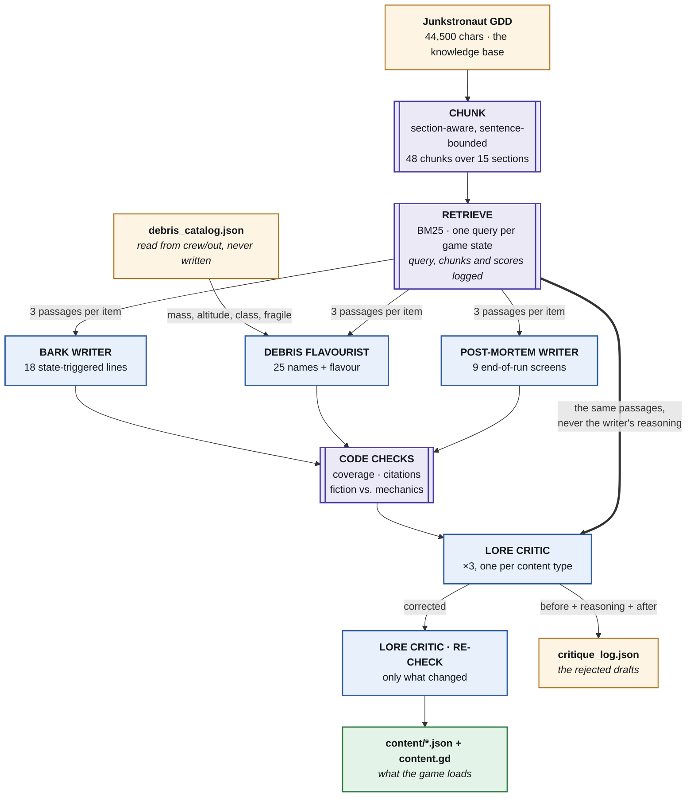

# The content pipeline, in one picture

## What is a model and what is not

Everything in purple is code with no model in it: the chunker, the retriever, the coverage
and citation checks, the fiction-versus-mechanics check, and the decision to apply a
correction. Everything in blue is an agent. Nothing crosses.

That line is where the pipeline's claims come from. "Retrieval is accurate" is a number
computed against labels written before either retriever ran. "The fiction matches the
mechanics" is a comparison of two files. "The critic caught a lore break" is an agent's
judgement — and it is the only one of the three that is, which is why the report prints the
passage the critic cited next to the line it rejected.

## The one edge that matters

`RET ==> LC` is drawn heavy because it is the design decision the critic stage rests on. The
critic is given the retrieved passages and the generated items, and **not** the writer's
`why` field. `run-content.js` strips it before the call.

A critic that reads the writer's justification is a critic being argued with: a confident
sentence about why a line is fine talks it into agreeing with a passage that says otherwise.
This is the same discipline the tuning crew's Spec Auditor runs on — given the design
document rather than the other agents' reasoning — and it is copied here deliberately.
