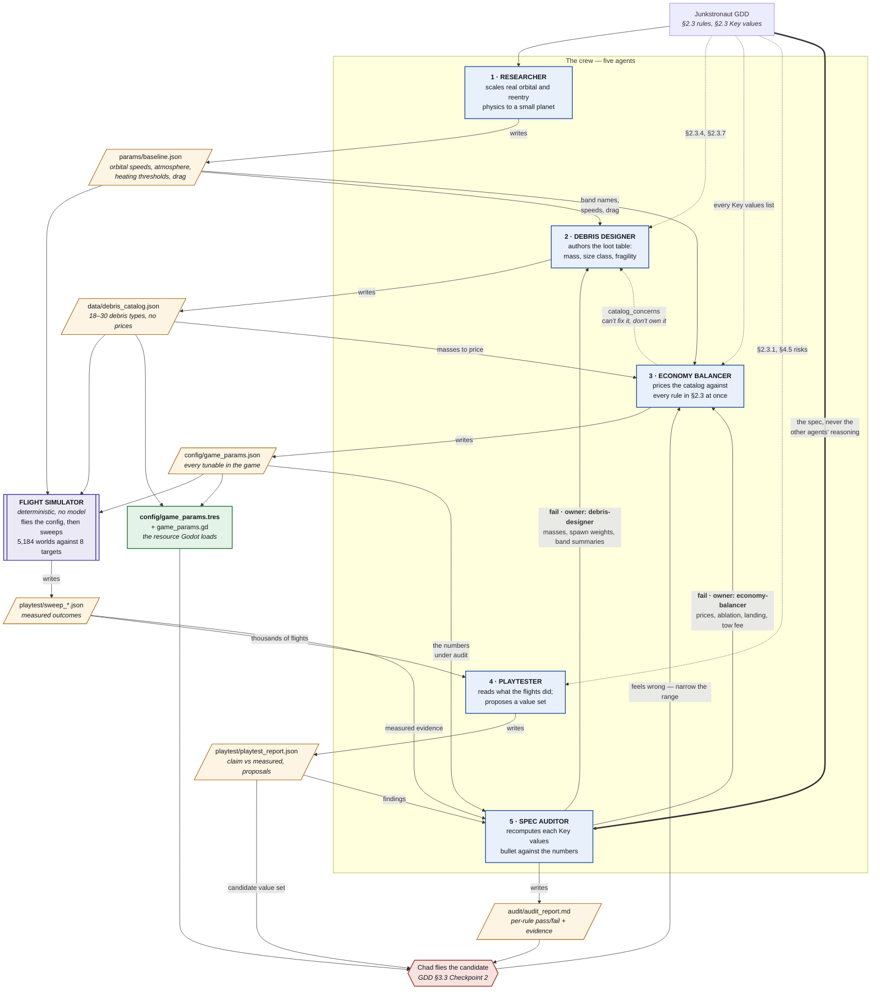
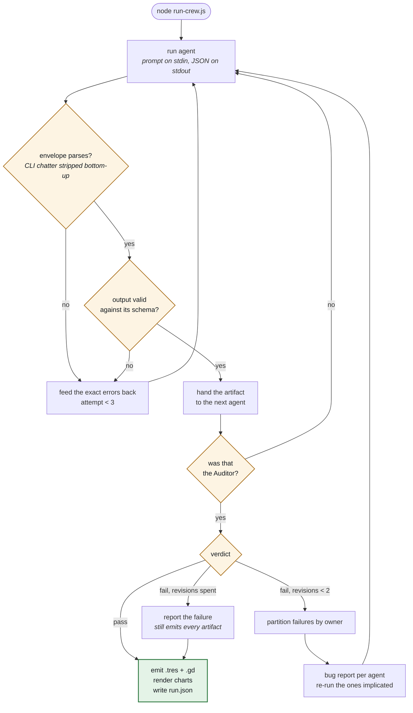

# Junkstronaut tuning crew — architecture

Five agents, one deterministic orchestrator, two feedback edges, and a flight simulator in
the middle. Every arrow between agents is a **file**, not a conversation: each agent writes
a schema-checked JSON artifact and the next agent reads it. Nothing is passed as chat
history, so any stage can be re-run alone.

## Agent roles and data flow

**The simulator is scaffolding, not an agent.** It integrates trajectories at a fixed
timestep with no randomness and no model in the loop, which is what makes a sweep of
thousands of flights mean anything (GDD §4.4, headless determinism). It keeps a hard line
between physics and game rules: gravity, drag, heating and orbital mechanics are simulated;
how peak heat converts to shield ablation is a *design decision* and is taken from the
Balancer's params rather than re-derived. Simulating the physics and applying the crew's
rules is what lets the sweep answer "is the cheapest descent really 2–4 passes" by
measurement instead of by restating the formula that claimed it.

**Why the Playtester sits between the simulator and the Auditor.** The sweep produces
thousands of rows; somebody has to say what they mean. The Auditor could read them, but it
answers a different question — *does the config obey the written rules* — and the GDD (§3.1)
draws that boundary explicitly: QA tests conformance, the Playtester measures behaviour and
proposes numbers. Only the Playtester emits a candidate value set, which is the artifact
Chad actually flies at Checkpoint 2, and only the Playtester distinguishes a **tuning**
problem (grid configurations exist that fix it) from a **design** problem (almost none do,
so the rule itself has to change). That distinction decides whether you go hunting for a
value or rewrite a mechanic, and nothing else in the crew produces it.

The thick arrow into the Spec Auditor is load-bearing. The Auditor is given the **design
document**, never the other agents' reasoning — if it audited their reasoning it would
encode their mistakes along with their intent. It checks numbers against the spec and
nothing else.

**Why there are two return edges and not one.** Every check the Auditor emits carries an
`owner` — the agent whose artifact the rule is actually about — and failures go back to
that agent. Catalog rules (piece masses, spawn weights, band summaries) return to the
Debris Designer; parameter rules (prices, ablation, landing, tow fee) return to the Economy
Balancer.

This was not the first design. The first version had one edge, everything returning to the
Balancer, and it produced exactly the failure you would expect: when the audit failed on
*fragile spawn share* — the Designer's data — the Balancer was the only agent in the loop,
so it emitted a corrected copy of the catalog inside its own output. The audit then passed.
The run was green and the repo had two loot tables that disagreed, with the corrected one
guaranteed to lose the moment anyone opened the original file.

The Auditor caught it, in an observation rather than a check:

> Only the params copy is correct. Whichever file ends up in the repo as the debris source
> of truth needs to be the params one, or the spawn-share fix will be silently undone.

So the Balancer can no longer do that — its schema forbids extra keys, and it has a
`catalog_concerns` field instead: a way to say *this is wrong and it is not mine to fix*.
The dotted arrow is that channel. The general rule is worth stating plainly, because it is
the thing that makes a crew a crew rather than a relay: **an agent that can edit another
agent's artifact to pass its own gate is not being audited.**

## How the orchestrator drives it

The chain above is what the agents do. This is what the **code** does, and none of it is a
model decision — control flow, retries and gates are all deterministic scaffolding.

Two gates, and they do different jobs:

- **The schema gate is syntactic** and it is cheap. A malformed artifact never reaches the
  next agent — it retries the agent that produced it, with the exact validation errors fed
  back in. Being told `$.upgrades: has 6 items, needs at least 12` fixes the problem far
  more reliably than being told to try again.
- **The audit gate is semantic** and it is the interesting one. It sends a per-rule bug
  report — naming the GDD section that failed and the arithmetic that showed it — back to
  whichever agent owns the artifact the rule is about.

Note where the judgement sits. The Auditor decides *which agent a rule belongs to*, because
that takes reading the rule. The orchestrator only reads the resulting label and dispatches
on it. Deciding is fuzzy work and belongs to an agent; dispatching is a switch statement and
belongs in code — so the routing is reproducible even though the labelling is not.

An audit that still fails after two revisions is **reported, not retried forever**. Every
artifact is still written and the exit code is still 0, because a crew that correctly
reports "these three rules cannot be satisfied together" is a crew that worked — that is a
design finding, and it is exactly what a human needs to see.
