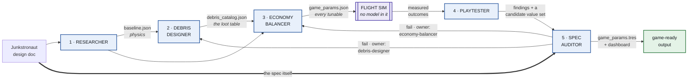

# Junkstronaut Tuning Crew

**The game: Junkstronaut.** A 2D pixel-art game about salvaging space junk. A Kessler
cascade has destroyed every satellite in orbit. You work at Mr. Armstrong's junkyard. You
fly a rocket built out of scrap up to the debris field, get out and drag junk home on
magnetic tethers, then survive reentry and land it. Sell the haul, buy upgrades, go higher.
This is my capstone project.

**What this crew produces:** the game's config file — `config/game_params.tres` — plus the
debris catalog it prices, an audit saying whether the numbers obey the design document, and
a playtest report saying what those numbers actually *do* when the ship is flown.

That one file matters more than it sounds. Junkstronaut's design says every tunable value
in the game lives in one config file and nothing is hardcoded anywhere. Gravity, thrust,
heat shield ablation, tow fees, magnet hold force, what each piece of junk weighs and what
it sells for — all of it. This crew is what writes that file.

The crew doesn't just argue about the numbers. A **flight simulator** sits in the middle of
it: it launches the ship, aerobrakes it and lands it, thousands of times, across every
altitude band and cargo load. Then it does the same across a grid of 5,184 different worlds —
varying gravity, air density, ship mass and frontal area — to find where the design's own
targets are achievable at all. So when the crew says a full hold lands at 4.4 m/s, that is
a measurement, not an argument.

---

## Run it

You need two things:

1. **Node.js** — check with `node --version`
2. **Claude Code, signed in** — your normal login is enough. No API key, no billing setup.

Then, from this folder:

```bash
node run-crew.js
```

That's it. It prints what it's doing as it goes, and everything it makes lands in `out/`.

**Budget an hour and a half.** A clean pass is 30–40 minutes; a run that fails its audit and
takes both revision rounds — which is the normal outcome on the current design — took 93
minutes the last time it was recorded. Most of that is agents thinking hard, the Balancer
solving every design constraint at once and the Auditor recomputing all of them, plus about
eighteen minutes of simulator per round: the exploration grid is re-flown every round, because
a revision moves the very numbers it scores against. If you only want to confirm the thing
runs, use the replay below instead.

### No credentials? Run this instead

```bash
node run-crew.js --stub
```

This replays a recorded run through the exact same code — same agents, same handoffs, same
checks, same output files — without calling any model. It finishes in about a second and
needs no login at all. Use it if you just want to confirm the crew runs.

### Other ways to run it

If you'd rather not use a terminal, open Claude Code in this folder and say **"run the
crew"**. It knows what to do.

There is no Docker, no `npm install`, no Godot needed. The crew has zero dependencies.

<details>
<summary>Flags, if you want them</summary>

```
--stub              replay a recorded run; no model calls, no credentials
--record            run live, then save the logs so --stub replays this run
--reuse a,b         replay these agents from stubs, run the rest live
--gdd <file>        point at a different design document
--out <dir>         write somewhere other than crew/out
```

`--reuse researcher` is the useful one while iterating: the Researcher's answer doesn't
change when you edit a downstream agent, and skipping it saves about nine minutes a run.

Replaying the Researcher, the catalog and the params for a round also restores that round's
recorded sweep, so resuming an interrupted run doesn't re-fly a grid whose inputs never
changed. All three have to be replayed, not just the params — a live Designer revision moves
the full hold mass, which moves every target that reads a hold.

A full live run takes roughly 30–45 minutes, most of it the Balancer and the Auditor
thinking. Set `JUNK_MODEL=sonnet` for a faster, cheaper run.
</details>

---

## The five agents

They run in order. Each one writes a file, and the next one reads it.

| # | Agent | Gets | Produces |
|---|---|---|---|
| 1 | **Researcher** | The design document | Real orbital and reentry physics, scaled down to the game's small planet — orbital speeds, air density, the speed where heating starts, drag |
| 2 | **Debris Designer** | The physics + the design doc | The loot table. 18–30 kinds of space junk, each with a weight, a size class, and whether it's fragile |
| 3 | **Economy Balancer** | The physics + the loot table | Every tunable number in the game. Prices the junk, sets the upgrade costs, tunes reentry and landing |
| 4 | **Playtester** | The numbers, flown thousands of times | What the config actually does, where that contradicts the design, and a candidate value set to try instead |
| 5 | **Spec Auditor** | The design document + everything above | A pass/fail check on every rule in the design doc, with the arithmetic shown — and a label saying whose problem each failure is |

Between agent 3 and agent 4 sits the **flight simulator**. It isn't an agent — it's plain
code with no model in it, so the same config always produces the same trajectory. It flies
the ship and hands the Playtester the results.

The Auditor is deliberately handed the **design document**, not the other agents' reasoning.
If it read their reasoning it would absorb their mistakes along with their intent.

### Why none of them can be removed

- Take out the **Researcher** and nobody downstream has physics. The Balancer would be
  inventing gravity.
- Take out the **Debris Designer** and there is nothing to price. The whole economy is
  built on what the junk weighs and how rare it is.
- Take out the **Economy Balancer** and there is no config file. That is the thing the
  game actually loads.
- Take out the **Playtester** and thousands of flight results go unread. It is also the only
  agent that separates *"these numbers are wrong"* from *"this rule can't work at any
  numbers"* — and that difference decides whether you go hunting for a value or rewrite a
  mechanic. It's the only one that proposes a value set, too, which is the thing a human
  actually flies.
- Take out the **Spec Auditor** and nothing checks the work. This is the one that turns a
  straight line into a loop.

That last one is the important one. The Auditor doesn't just approve or reject — **when it
fails a rule, the finding goes back to whichever agent owns the data that's wrong**, with
the rule that broke and the math that proves it. Numbers go back to the Balancer. Problems
with the junk itself — how heavy a piece is, how often it spawns — go back to the Designer.
Then everything downstream re-runs and the Auditor checks again, up to twice.

**Why it routes instead of always going to the Balancer.** The first version of this crew
sent every failure to the Balancer, and it went wrong in a way worth keeping in the README.
The audit failed because fragile junk was spawning too often near the top of the band — that's the
Designer's data. But the Balancer was the only agent in the loop, so it did the only thing
it could: it wrote a corrected copy of the junk list inside its own output. The next audit
passed. Everything looked green, and the project now had two junk lists that disagreed,
with the wrong one in the file everybody reads.

The Auditor noticed and flagged it. So now the Balancer isn't allowed to touch the catalog
at all — it can only say "this is wrong and it isn't mine to fix," which sends the problem
to the agent that can. The rule underneath is simple: **an agent that can edit the thing
it's being judged on isn't being judged.**

---

## What it checks

The design document has a "Key values" list under every mechanic. Those are promises about
the finished game. The Auditor turns each one into a check and does the arithmetic:

- A full cargo hold roughly doubles the ship's mass
- The cheapest way down is 2 to 4 aerobraking passes — never one dive, never a dozen
- The skim cost curve bottoms out at 1 to 2 skims from the top of the band, and reproduces its own
  coefficients — a separate question from the one above, and checked separately, because a
  skim and a pass are different things and mixing them up produced three wrong answers before
  anyone noticed
- A fully loaded ship under a parachute lands *just* under the 5 m/s soft-landing line
- The claimed descent speed is what the stated canopy actually flies — the parachute's area
  is in the config, so the simulator flies it instead of solving it backwards out of the
  answer it was supposed to be checking
- The tow fee never goes above 50% and never goes below zero
- A lazy run still breaks even
- Towing junk normally never rips a magnet off — only yanking it does
- Fragile junk can never be crushed, at any upgrade tier
- **Nothing passed by moving the goalposts** — see below

Each check reports the numbers it compared, so you can see *why* it passed instead of
taking its word for it.

That last check exists because of something that happened on a real run. The Balancer
couldn't make "a full hold doubles the ship's mass" come out right, so it widened the cargo
hold from 6 slots to 21. The rule then passed — but 6 wasn't a number anyone was free to
change. The design document has the player reading "Cargo reads 4 of 6" on screen. The
Auditor let it through as a pass and flagged it in the notes, which was the right instinct
in the wrong place, so it's now a check of its own: **if a rule only passes because a fixed
number moved, the rule didn't pass.**

---

## What you get

Everything lands in `out/`:

```
config/game_params.tres    the resource file the game loads
config/game_params.gd      its companion script, so Godot can read it
config/game_params.json    the same numbers as plain JSON
data/debris_catalog.json   the loot table
params/baseline.json       the physics, with the math shown
audit/audit_report.md      every rule checked, pass or fail, with evidence
playtest/playtest_report.json    what the flights measured vs what was claimed
playtest/sweep_verification.json every scenario flown with these numbers
playtest/sweep_exploration.json  5,184 worlds scored against 8 design targets
report/dashboard.html      the charts — open this one in a browser
run.json                   what ran, how long it took, which model
logs/                      every prompt sent and every reply received
```

The `.tres` and `.gd` files drop straight into a Godot project under `config/`. They are
the point of the whole thing.

`out/` is committed, so you can read a finished run without running one. It is a sample, not
a build artifact: a replay overwrites it, and `run.json` and `dashboard.html` will each come
back one line different because they carry the time the run finished. That churn is the
timestamp and nothing else.

### The charts

`report/dashboard.html` is a single file with no internet connection required — just open
it. It draws four things:

- **Value against mass**, one dot per piece of junk. The design bet is that the valuable
  stuff is also the heavy stuff, so hauling a good load home should be harder. If this
  cloud slopes up, the bet holds. Hollow rings are fragile pieces.
- **The ablation curve** — how much heat shield a landing burns depending on how many
  aerobraking passes you split it into. It should be cheapest at 2 to 4 passes: one big
  dive is expensive, a dozen little ones are expensive, a few planned ones are right.
- **Value per cargo slot**, by size class. If one class wins everywhere, the choice of what
  to grab stops being a choice.
- **The ablation surface**, in 3D. The same trade-off with both inputs at once — how fast
  you're coming in, and how many passes you take. The dark line along the valley floor is
  the cheapest strategy at every speed, and it should stay in the 2–4 range across the
  whole span.

The numbers on the ablation charts are the Balancer's own arithmetic, not the renderer's.
That distinction cost a bug: an earlier version worked the curve out for itself, used a
different starting assumption, and drew a chart that disagreed with the audit printed
directly beneath it. Now the Balancer has to show its work and the chart just plots it.

---

## What the simulator does

`lib/sim.js` is a 2D flight model — a few hundred lines of plain Node, no engine required.
It integrates the ship's trajectory at a fixed timestep: gravity, an exponential atmosphere,
drag, heating, orbital mechanics, and terminal velocity under the parachute.

It keeps a hard line between two kinds of number:

- **Physics is simulated.** How fast the ship is going, how hot it gets, whether it skips
  back out of the atmosphere.
- **Game rules are applied, not re-derived.** How peak heat turns into shield damage is a
  *design decision*, so it comes from the Balancer's params. Simulating the physics and
  applying the crew's rules is what lets the sweep answer "is the cheapest descent really
  2–4 passes" by measurement, instead of by restating the formula that claimed it.

Then it sweeps. 5,184 worlds, varying planet radius, gravity, air density, the ship's frontal
area, its dry mass, its tank size and its engine, each scored against eight targets pulled
from the design: is the band reachable at every sample altitude, is the fuel margin sane, does skimming actually
cool the committed entry, does that benefit saturate, is an unstaged braking pass survivable,
does a full hold land soft, does greed cost something, does the return leg get harder with
altitude. (`node bench.js --targets` prints them with what each one asks for.)

That's the part a single config can never answer. Not *"are these numbers good"* but
*"where in the parameter space is there a good set of numbers at all"* — and if almost
nowhere satisfies a target, that's a fact about the design rather than about the numbers.

## How it's built

The orchestrator is `run-crew.js` — plain Node, no dependencies. Each agent is a markdown
file in `agents/` describing its job and the exact JSON it has to return. Each of those
JSON shapes has a schema in `schemas/`.

**No model decides what happens next.** The agents do the thinking; the code decides the
order, the retries, and when to stop. If an agent returns something malformed, the schema
catches it and the agent is asked again with the exact error — up to three tries. If the
audit fails, the findings are sorted by which agent owns them and those agents re-run — up
to two rounds. Then it stops and reports.

The routing is the one place worth being precise about the split. Deciding *which agent a
broken rule belongs to* takes reading the rule, so the Auditor does it and writes the answer
into its output. Acting on that label is a switch statement, so the code does it. The
judgement is an agent's; the control flow never is.

That last part is deliberate: **a failing audit is not a crash.** The crew still writes
every file and still exits cleanly. It just says clearly which rules couldn't be satisfied.
That's a real answer about the design, and it's the answer I'd most want to know.

This crew is the front half of a larger autonomous pipeline I built separately — it writes
the spec and the config, and the pipeline implements against them. The agent files here use
that pipeline's format on purpose, so they plug straight in. But nothing here depends on
it. This folder runs on its own.

---

## Files

```
run-crew.js              the orchestrator — start here
bench.js                 score candidate configs against the design targets, one at a time
agents/                  the five agents, one markdown file each
schemas/                 the JSON contract for each agent's output
lib/agent.js             runs one agent, validates it, retries with the error
lib/schema.js            the JSON Schema checker (hand-rolled, no dependencies)
lib/sim.js               the 2D flight model
lib/sweep.js             the scenario matrix and the 5,184-world grid
lib/godot.js             writes the .tres and .gd files
lib/charts.js            renders the dashboard
test/                    the test suite — no credentials, about a second
stubs/                   a recorded run, for --stub mode
DIAGRAM.md               architecture diagrams
```

### Tests

```bash
node --test "test/*.test.js"
```

68 tests, no credentials, no install, about a second. They cover the schema validator, the
envelope parser, the ablation rule, the full-hold mass, the retry-with-feedback loop and the
audit routing.

Use that exact invocation. `node --test test/` does not resolve, and a bare `node --test`
discovers `test/fixtures/fake-agent.js` — a stand-in for the CLI rather than a test — and
hangs waiting for a prompt on stdin.

It exists because **`--stub` is not a test.** A replay reads its sweep straight out of
`stubs/`, so it never executes a line of `lib/sim.js` or the scoring in `lib/sweep.js` —
which is precisely where everything interesting in this project is measured. The replay
proves the orchestrator still runs; the tests prove the physics and the plumbing still work.

## The shape of it



Full diagrams, including how the orchestrator's gates work, are in
[DIAGRAM.md](DIAGRAM.md).
